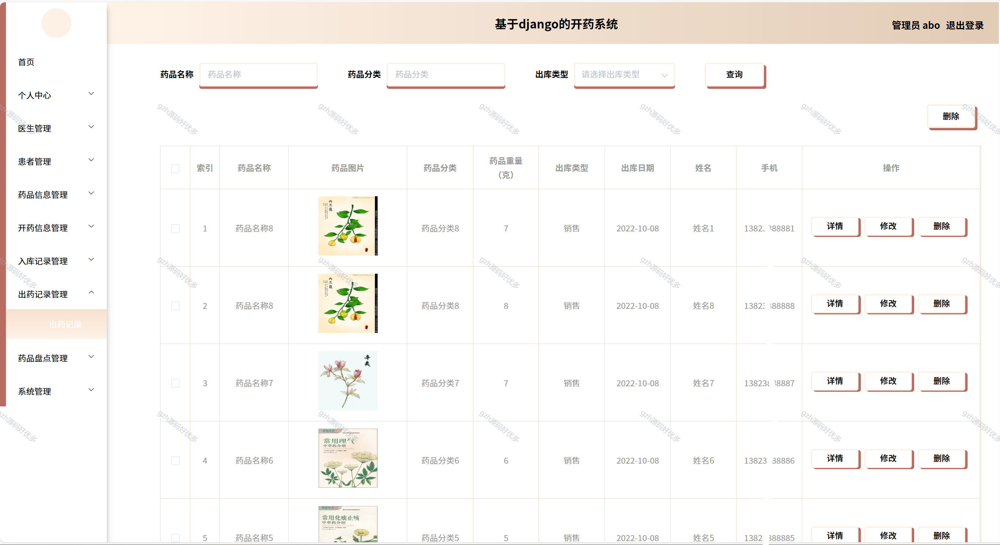
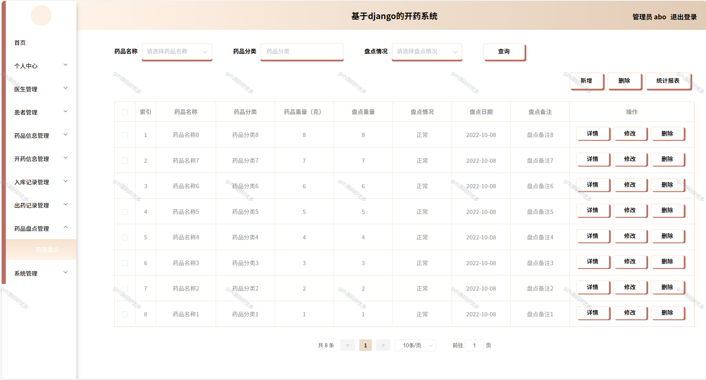

# python096
python096基于Python+Django的开药系统+LW+PPT
 
## 查看主页获取源码

### 一、关键词
处方开具系统，处方管理系统，用药开具系统

### 二、作品包含
源码+数据库+设计文档万字+PPT+全套环境和工具资源+本地部署教程

### 三、项目技术
前端技术：Vue2.0、Element-ui
后端技术：Python3.7、Django2.0

### 四、运行环境（以下版本亲测，其他版本兼容性请自行测试）
开发工具：PyCharm + VSCODE

数据库：MySQL5.7（最低要5.7版本）

数据库管理工具：Navicat10+

Python：Python3.7

前端Nodejs：14

浏览器：谷歌浏览器

### 五、项目介绍
项目编号：python096

开药系统是在的数据存储主要通过MySQL。用户在使用应用时产生的数据通过Python语言传递给数据库。通过此方式促进开药信息管理和数据传输效率，提供一个内容丰富、功能多样、易于操作的平台。述了数据库的设计，系统的详细设计部分主要论述了几个主要模块的详细设计过程。

### 六、运行截图

